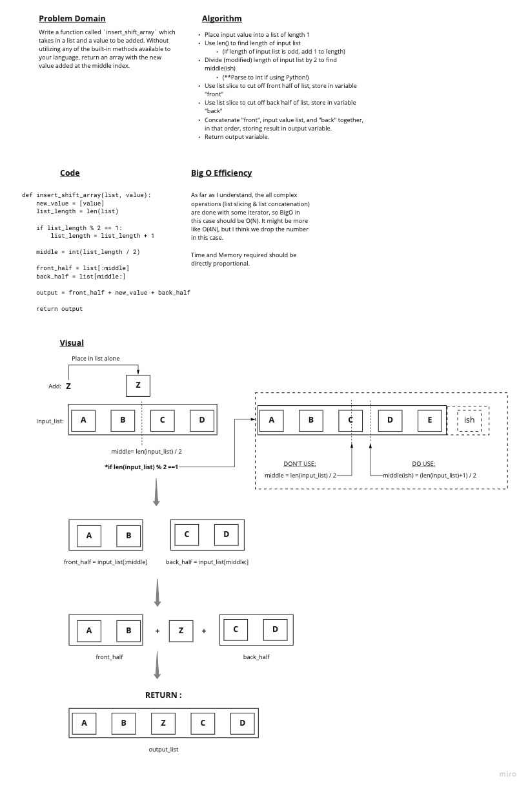

# Array Insert Shift whiteboard challenge

Problem:

Write a function called `insert_shift_array` which
takes in a list and a value to be added. Without utilizing any of the built-in methods available to your language, return an array with the new value added at the middle index.

## Whiteboard Process

## Approach and Efficiency

This approach does things pretty sequentially. Summed up, the code:

1. Finds the middle of the input list by dividing the length in half (with a slight modification for odd lengths)
2. Uses list slices to separate the front half and back half of the input array.
3. Uses concatenation to combine the front half, the input value in an array of its own, and the back half together (in that order).

Going in I planned to use the following 'tools': `len()`, `list[:]`, `+` (concatenation), and `% 2 == 1` (finding odd numbers).
