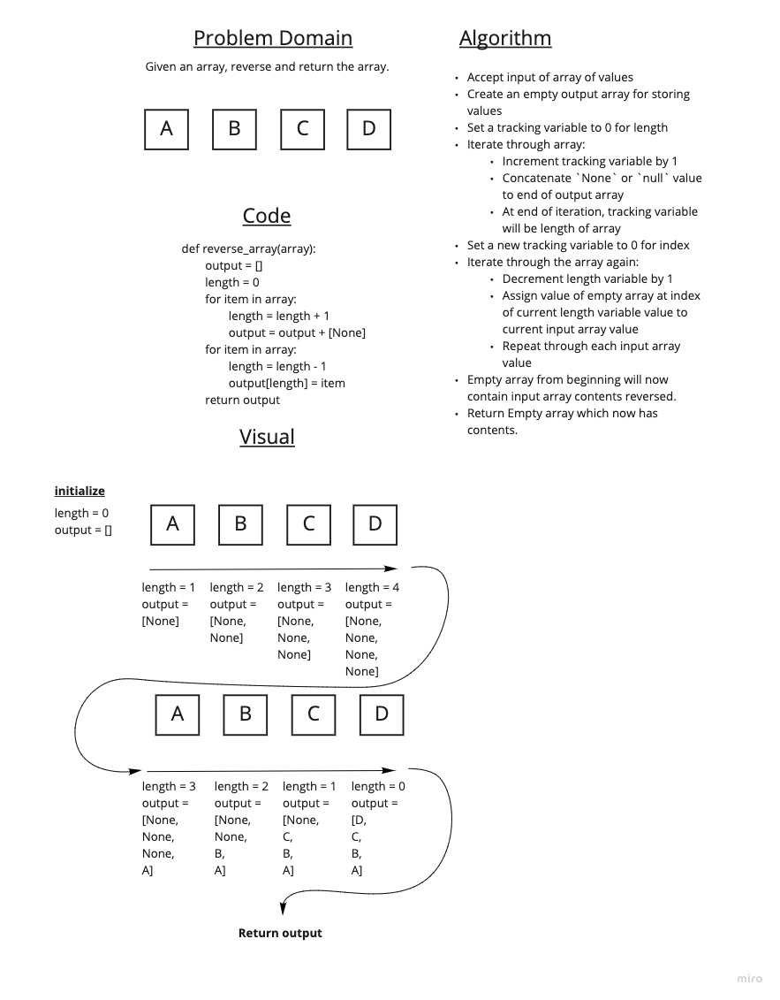

# Array Reverse challenge white board

Problem: Given an array write a function that accepts and returns the reverse of the given array.

## Whiteboard Process

## Approach & Efficiency

I knew that the easiest way to approach this would be with iteration, so I took that approach. The idea is to iterate once, to get the length of the input array and generate a "dummy array" for output purposes, then iterate a second time to fill in the "dummy array" with values from the input, using decrements on the length of input array to point to specific output indices.

Big O of this should be O(N), since the iterations scale with input array length.
