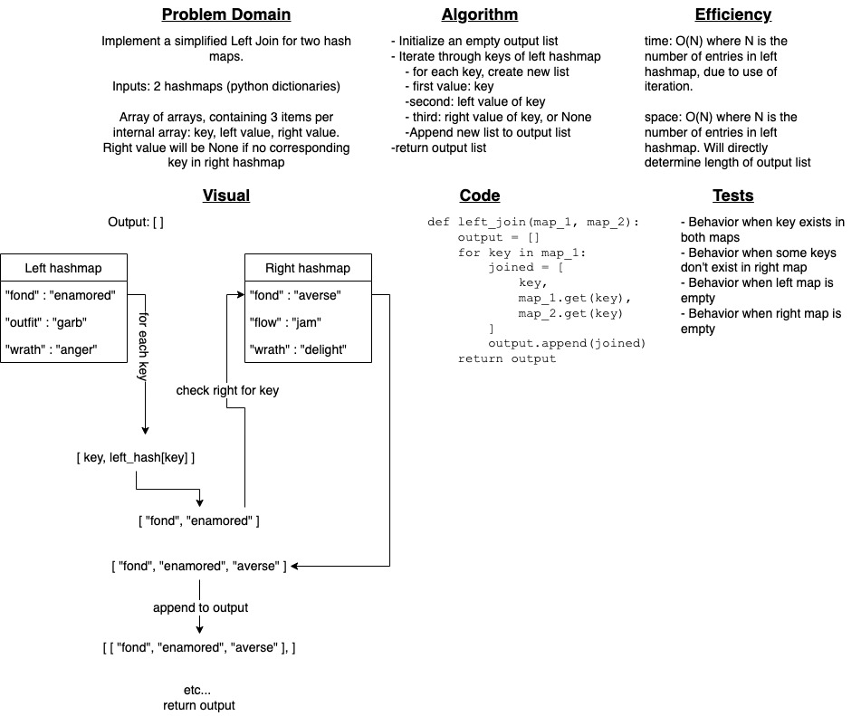

# Challenge Summary

Implement a simplified Left Join for two hash maps.

The input will be two hashmaps in the form of Python dictionaries.

The output will be an array of arrays, containing 3 items per internal array: key, left value, right value. Right value will be None if no corresponding key in right hashmap

## Whiteboard Process

## Approach & Efficiency

Solution utilizes a for loop to iterate through the first hash map. Each loop, the key and value from the left map are placed in an array, alongside a third value accessed by checking the right hashmap for the key of the current loop. The resulting 3-item array gets appended to an empty output array, and the output array is returned once iteration completes.

Time efficiency: O(N) where N is the number of entries in left hashmap, due to use of iteration.

Space efficiency: O(N) where N is the number of entries in left hashmap. Will directly determine length of output list

## Solution

`left_join(map_1, map_2)` - Accepts two hashmaps (python dictionaries) as arguments and returns an array of arrays, where each internal array contains the key, left value, and right value or None if not present in right map.
