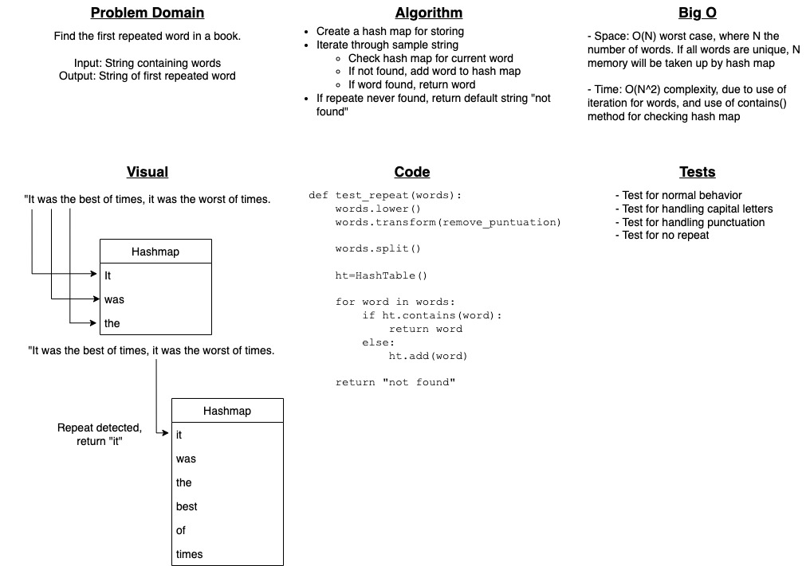

# Challenge Summary

Find the first repeated word in a book.

The input will be a string and the output will be a string of the first repeated word.

## Whiteboard Process

## Approach & Efficiency

Solution utilizes a hash map for storage of words and checking for repetition. Some initial data manipulation is done, making everything lower case and removing punctuation. The words are then split into a list and iterated through. Each loop, the hash table is checked for a given word. If found, the word is returned. If not found, the word is added to the hash table for use in the next loop. If no repetition is found by the end of iteration, a default string of `"No repeated strings found!"` is returned.

Time efficiency is a worst case of O(N^2), where N is the number of words provided. This is due to use of iteration and nested `contains()` method. `contains()` has a worst case O(N) efficiency.

Space efficiency is O(N), where is the number of words provided, since they have to be stored within the hash table.

## Solution

`find_first_repeat(sample)` - Accepts a sample string of several words as an argument. Returns the first repeated word detected, ignoring punctuation and capitalization. If no repeated words are detected, a default of `"No repeated strings found!"` is returned.
