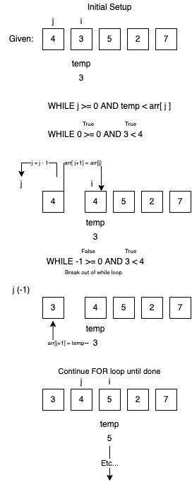

# Algorithm Breakdown: Insertion Sort

The insertion sort algorithm steps through a list and compares each value to the values before it in the sequence. When the algorithm finds an appropriate spot for the item, reassignments are done as necessary to sort them.

In words it's difficult to sum up concisely, so let's view some pseudocode:

```
InsertionSort(int[] arr)

    FOR i = 1 to arr.length

        int j <-- i - 1
        int temp <-- arr[i]

        WHILE j >= 0 AND temp < arr[j]
            arr[j + 1] <-- arr[j]
            j <-- j - 1

        arr[j + 1] <-- temp
```

Great. So what's happening here? Let's go through it line-by-line.

## Insertion Sort, Step-by-Step

1. `FOR i = 1 to arr.length` - we begin by stepping into a for loop, where we'll be iterating from the 1th index of a list to the end. The index will be represented by `i`.
2. `int j <-- i - 1` - once inside out loop, we assign variable `j` to be 1 less than `i` (making `j` the previous index)
3. `int temp <-- arr[i]` - a temporary variable is created for retaining the value at `arr[i]` as we shuffle later.
4. `WHILE j >= 0 AND temp < arr[j]` - within our FOR loop, we now step into a while loop. The condition is to check that j (the left index) is >= 0 and that our temp (the value being sorted) is < `arr[j]`, the value at the jth index.
5. `arr[j + 1] <-- arr[j]` - if both conditions are met, we haven't found the a spot for the value stored in `temp`, so we will shuffle the value at j one position to the right in our sequence.
6. `j <-- j - 1` - since we shuffled the `j` value one position right, we will now move j itself one position left, for the next comparison (if the WHILE loop persists).
7. `arr[j + 1] <-- temp` - breaking out of the WHILE loop means that the space to the right of j is where our comparison value belongs, so we assign `arr[j + 1]` the value stored in our temp variable.
8. Thanks to our FOR loop, steps 2-7 repeat until the entire list is iterated through, and at the end we have a list that has been sorted in place!

## Visual



## Efficiency

* Time efficiency: O(N^2), due to the nature of the nested loops, worst case scenario will result in time efficiency scaling of N^2, where N is the length of the input list.
* Space efficiency: O(N), assignments are done in loops and the list is mutated in place. Space consumed will scale directly with length of input, but the argument could be made that the space is taken up prior to the function being called.
