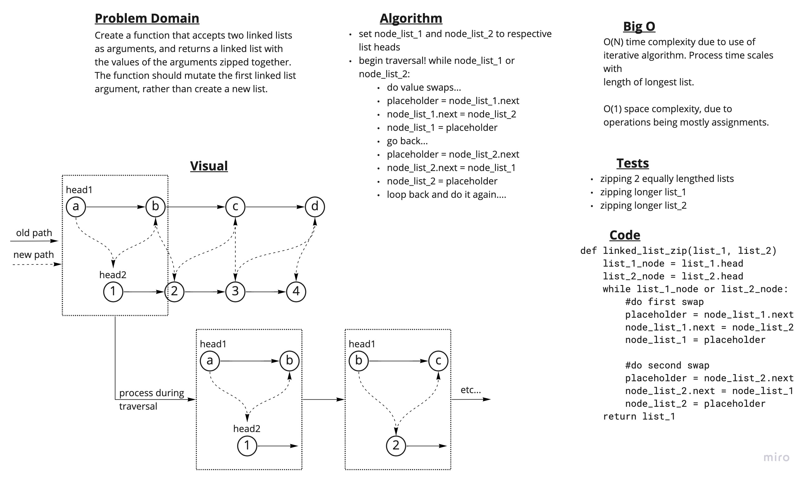

# Challenge Summary

Create a function that accepts two linked lists as arguments, and returns a linked list with the values of the arguments zipped together. The function should mutate the first linked list argument, rather than create a new list.

## Whiteboard Process



## Approach & Efficiency

I took an iterative approach, shuffling values using a placeholder variable.

Big O space complexity is O(1), since all operations are assignments. The only additional space required is for placeholder variable during execution.

Big O time complexity is O(N), due to the use of an iterative solution. Time complexity will scale directly with the length of the shortest linked list argument.

## Solution

Code can by invoking the associated function:

```Python
zipped_list = linked_list_zip(list_1, list_2)
```
