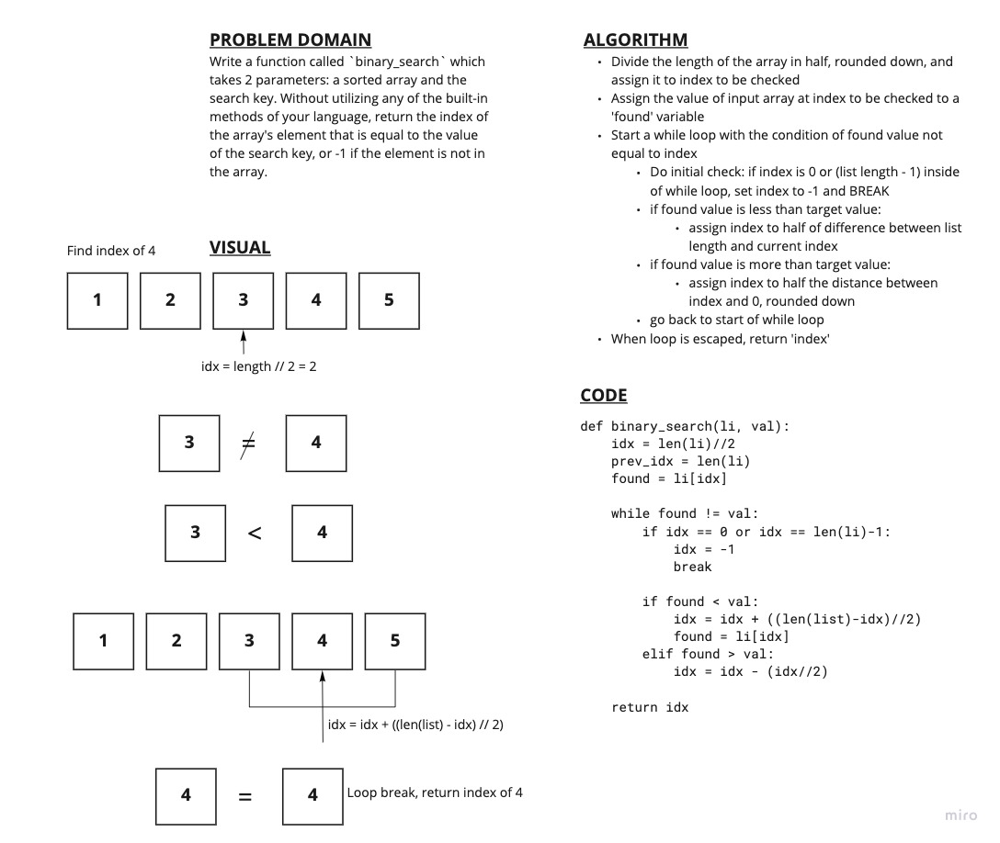

# List Binary Search

## Problem Domain

Write a function called binary_search which takes in 2 parameters: a sorted array and the search key. Without utilizing any of the built-in methods available to your language, return the index of the array’s element that is equal to the value of the search key, or -1 if the element is not in the array.

## White Board

## Process and Big O

The algorithm iteratively splits the array left and right. With each new split, a while loop checks the current value against the target value. If not matching, the array is split again to the left or right repeatedly checking the middle until the target value is found. If the while loop is entered after the first or last index has been checked, the sets index to -1 and breaks. The final step is to return whatever index is found.

Big O time for this seems like it would be logarithmic O(log(N)), since steps required should increase slower than the rate of the length of the array increasing. Big O space should be linear O(N), since the only changing value in size is the length of the array.
