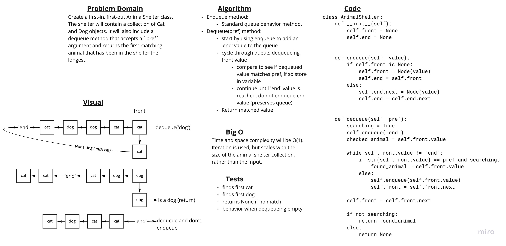

# Challenge Summary

Create a first-in, first-out AnimalShelter class.
The shelter will contain a collection of Cat and Dog objects. It will also include a dequeue method that accepts a `pref` argument and returns the first matching animal that has been in the shelter the longest.

## Whiteboard Process



## Approach & Efficiency

I took the approach of using a standard queue and cycling animals from the front to the back, retaining the first match.

In hindsight if I were to refactor, I would try to write this as a queue built from stacks. Since that system inherently passes nodes back and forth from front to back, I believe it would lend itself to a simpler solution.

## Solution

```Python
# to instantiate a new shelter
shelter = AnimalShelter()

# to add a new animal:
shelter.enqueue(Cat('name'))
#or
shelter.enqueue(Dog('name'))

# to retrieve an animal from the shelter:
animal = shelter.dequeue('cat')
#or
animal = shelter.dequeue('dog')

# NOTE: attempting to retrieve an animal not in the shelter will return None. Attempting to retrieve from an empty shelter will raise an exception.
```
