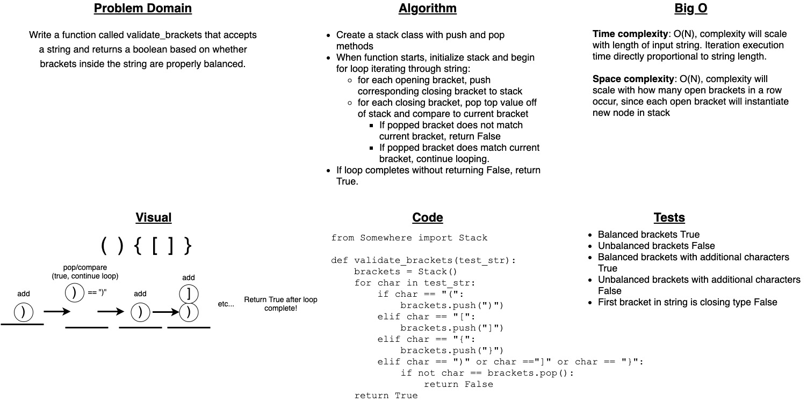

# Challenge Summary

Write a function called validate_brackets that accepts a string and returns a boolean based on whether brackets inside the string are properly balanced.

## Whiteboard Process



## Approach & Efficiency

Since brackets must be closed in the order that they are opened, I used a stack to solve this problem. As the function iterates through the input string, opening brackets push their associated closing bracket to the stack. When the iteration reaches a closing bracket, the function checks for a match against the top of the stack and returns False if not matching.

## Solution

To use function, import and then invoke the `validate_brackets` function from stack_queue_brackets.py

```Python
from stack_queue_brackets import validate_brackets

string = "()[]{{}}"
validated = validate_brackets(string)

# Returns True or False, based on proper balance of brackets within string
```
