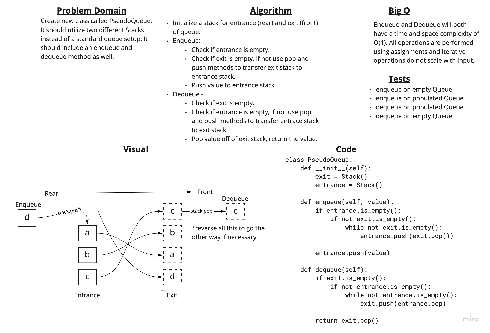

# Challenge Summary

Create new class called PseudoQueue. It should utilize two different Stacks instead of a standard queue setup. It should include an enqueue and dequeue method as well.

## Whiteboard Process

## Approach & Efficiency

The PseudoQueue utilizes two stacks: one for the entry to the queue and one for the exit of the queue.

When adding or removing items from the queue, the stacks are manipulated to place the values in either the entrance or exit stack, to bring either the first or last item to the top.

## Solution

`PseudoQueue.enqueue(value)` - adds a value to the rear of the queue

`PseudoQueue.dequeue()` - removes the value at the front of the queue and returns its value.
