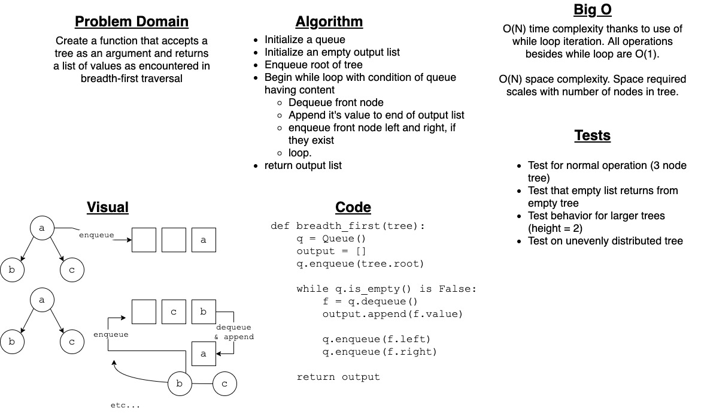

# Challenge Summary

Create a function that accepts a tree as an argument and returns a list of values as encountered in breadth-first traversal

## Whiteboard Process

## Approach & Efficiency

Utilizes a queue to accomplish breadth-first traversal of a tree.

Queue is implemented using `deque` from the Collections module of the standard library.

All operations are accomplished using O(1) operations, but due to use of iteration, time complexity is O(N) where N is the number of nodes in the tree.

Space complexity is also O(N) and scales with number of tree nodes, due to creation of output list for return.

## Solution

`breadth_first(tree)` - Returns a list containing all values within a binary tree as encountered using breadth-first (top-down left-right) traversal. Returns an empty list if argument is an empty tree.
