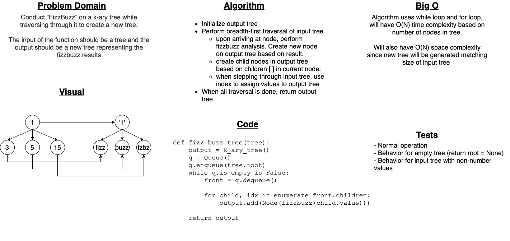

# Challenge Summary

Conduct “FizzBuzz” on a k-ary tree while traversing through it to create a new tree.

The input of the function should be a tree and the output should be a new tree representing the fizzbuzz results.

## Whiteboard Process

## Approach & Efficiency

I created an internal traverse function intended to be executed on the root of the input tree. The traversal function executes fizz buzz analysis, creating a new Node in the process, then assigns to the `.children` property of that node a recursive list comprehension of the input tree's children. This cascades down all children, performing fizzbuzz on each, and finally returning the resulting node.

When whiteboarding I originally intended to use a while loop, but couldn't figure out how to track my place in the tree using breadth-first traversal. Recursion seemed like the best approach here, and I'm really happy to have arrived at this solution.

Time efficiency should be O(N) where N is the number of nodes in the tree.

Space efficiency is also O(N). A new tree is created that scales with the number of nodes in the input tree.

## Solution

`fizz_buzz_tree(tree)` - Evaluates a given tree containing numbers for values and returns a matching tree with values as resulting from "fizz buzz." If a value is divisible by 3 the corresponding output value is "fizz", by 5 the corresponding value is "buzz", by both 3 and 5 the corresponding value is "fizzbuzz", else the corresponding value is the original value as a string. Returns a tree populated by results.
