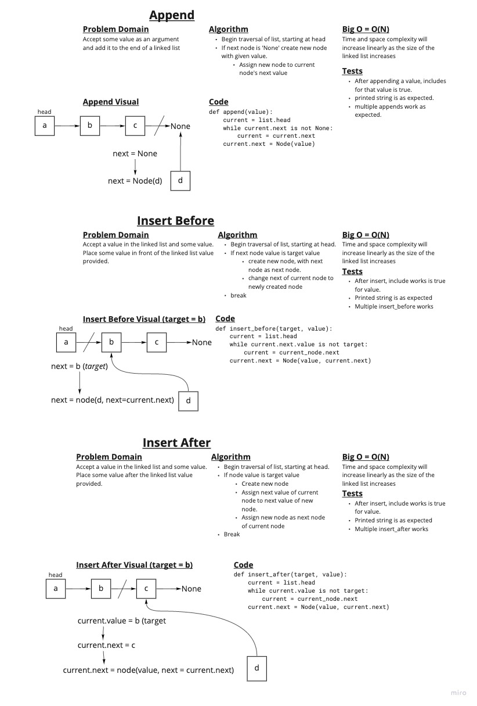

# Singly Linked List

Implementation of linked list data structure. A linked list is a collection of nodes that can be traversed through. One node is marked by the linked list as the head (where to begin traversal) and each node contains a value with it's stored data.

## Challenge

Implement a linked list data structure including methods to insert, check for inclusion, and represent the list as a string.

## Approach & Efficiency

The first step was set up my Node class for manipulation of data within the linked list.

Following that, the LinkedList class was fleshed out one step at a time. With each new method implementation a new test was created to ensure functionality.

Efficiency of methods should be as follows:

* `LinkedList.insert` - O(1), all operations are assignment.
* `LinkedList.includes` - O(N), complexity grows linearly with size of associated linked list, due to use of iterative traversal.
* `LinkedList.to_string` - O(N), complexity grows linearly with size of associated linked list, due to use of iterative traversal.
* `LinkedList.append` - O(N), complexity grows linearly with the size fo associated linked list, due to use of iterative traversal.
* `LinkedList.insert_before` - O(N), complexity grows linearly with the size fo associated linked list, due to use of iterative traversal.
* `LinkedList.insert_after` - O(N), complexity grows linearly with the size fo associated linked list, due to use of iterative traversal.

## API

* `LinkedList()` can be used to instantiate an empty list. This will create a linked list with a head value of `None`

  * `LinkedList.insert(value)` will insert a given value to the list. New value becomes head of list, placed before old head. Returns None.
  * `LinkedList.includes(value)` checks whether a given value is included within a linked list. Returns True or False.
  * `LinkedList.to_string()` returns a string representation of the linked list.
  * `LinkedList.append(value)` adds a value to the end of the linked list
  * `LinkedList.insert_before(target, value)` inserts a value to a linked list before a given target value
  * `LinkedList.insert_after(target, value)` inserts a value to a linked list after a given target value

## Linked list insertions white board

